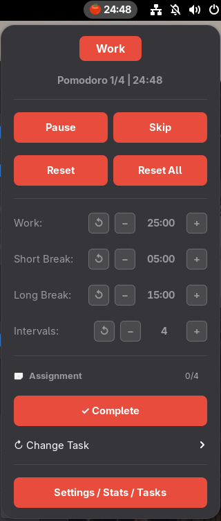
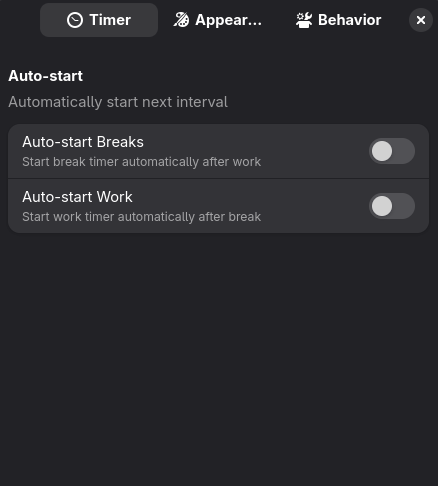
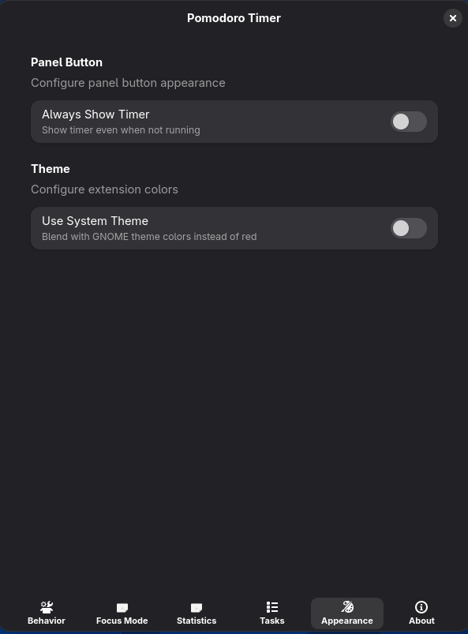
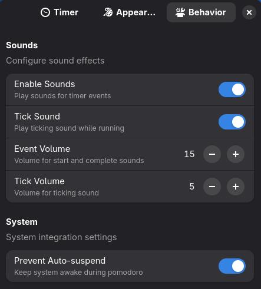

# 🍅 Pomodoro Timer

A sleek GNOME Shell extension for productivity using the Pomodoro Technique.


## Features

- **Timer Controls** - Start, Pause, Skip, Reset from the panel dropdown
- **Sound Notifications** - Audio alerts for timer events
- **Suspend Inhibitor** - Keeps your system awake during pomodoros (Caffeine Like)
- **Adjustable Durations** - Work, Short Break, Long Break, Intervals per Set
- **Minimal UI** - Timer hidden when idle, shown only when running
- **Quick Actions** - Right-click to Start/Pause, Middle-click to Skip

## Mouse Shortcuts

| Click | Action |
|-------|--------|
| Left-click | Open dropdown menu |
| Right-click | Start / Pause timer |
| Middle-click | Skip current session |

## Screenshots

| Dropdown Menu | Timer Settings |
|:-------------:|:--------------:|
|  |  |

| Appearance Settings | Behavior Settings |
|:-------------------:|:-----------------:|
|  |  |

## Settings

Open preferences via:
```bash
gnome-extensions prefs pomodoro-timer@Oguzhankokulu.github.com
```

| Setting | Description |
|---------|-------------|
| Auto-start Breaks | Automatically start break after work |
| Auto-start Work | Automatically start work after break |
| Always Show Timer | Show timer in panel even when idle |
| Enable Sounds | Play audio notifications |
| Tick Sound | Play ticking sound while running |
| Prevent Auto-suspend | Keep system awake during pomodoro |

## Installation

### From Source

```bash
# Clone the repository
git clone https://github.com/Oguzhankokulu/pomodoro-timer.git

# Rename the folder
mv pomodoro-timer pomodoro-timer@Oguzhankokulu.github.com

# Copy to extensions directory
cp -r pomodoro-timer@Oguzhankokulu.github.com ~/.local/share/gnome-shell/extensions/

# Compile schemas
glib-compile-schemas ~/.local/share/gnome-shell/extensions/pomodoro-timer@Oguzhankokulu.github.com/schemas/

# Enable extension (logout/login required on Wayland)
gnome-extensions enable pomodoro-timer@Oguzhankokulu.github.com
```

### To Update Existing Extension via GitHub

```bash
# Go to the extensions directory
cd ~/.local/share/gnome-shell/extensions/pomodoro-timer@Oguzhankokulu.github.com

# Pull the changes
git pull

# Compile schemas
glib-compile-schemas ~/.local/share/gnome-shell/extensions/pomodoro-timer@Oguzhankokulu.github.com/schemas/

# Enable extension (logout/login required on Wayland)
gnome-extensions enable pomodoro-timer@Oguzhankokulu.github.com
```

## Customization

### Custom Icon

Replace the panel icon by swapping `assets/images/fruit.png` or `assets/images/coffee.png` with your own **16×16 pixel** PNG image. Keep the filename as the same.

### Custom Sounds

Replace sound files in `assets/sounds/`:
- `start.ogg` - Plays when timer starts
- `tick.ogg` - Plays every second (if enabled)
- `complete.ogg` - Plays when interval completes

## Requirements

- GNOME Shell 45, 46, 47, 48, or 49
- `pw-play` (PipeWire, GNOME 46+) or `paplay` (PulseAudio) for sound playback

## License

GPL-3.0
