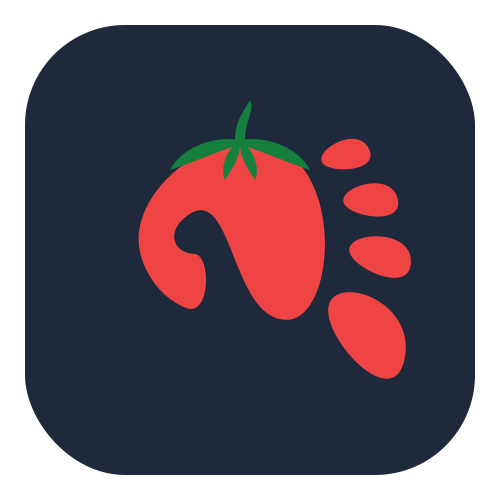
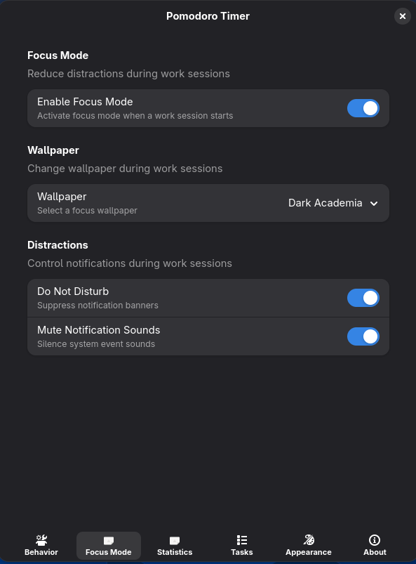
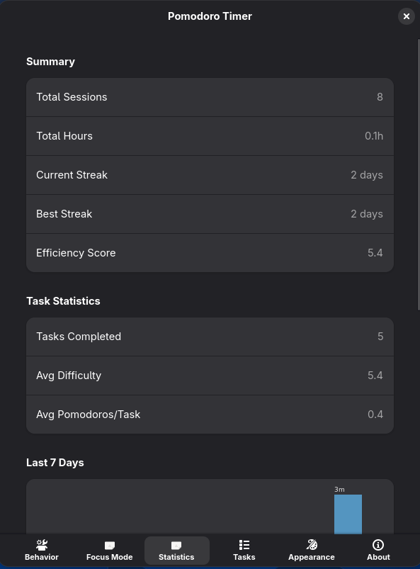
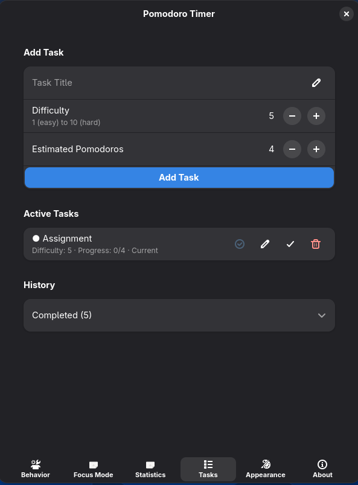
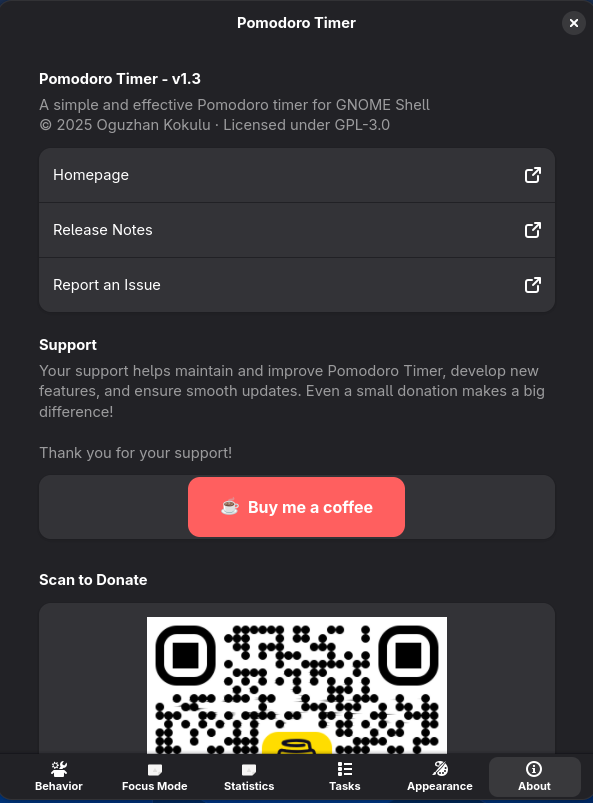

<div align="center">
  

  <h1>Pomodoro Timer</h1>

  <p><strong>A simple and effective Pomodoro timer for GNOME Shell</strong></p>
  <p>Stay focused, take breaks, and track your productivity — right from the top panel.</p>

  <br>

  
  

</div>

<br>

---

## Overview

Pomodoro Timer is a **full-featured productivity extension** for GNOME Shell built around the [Pomodoro Technique](https://en.wikipedia.org/wiki/Pomodoro_Technique).

It lives in your top panel and gives you timer controls, task management, focus mode with wallpaper switching and Do Not Disturb, session statistics with charts, configurable keyboard shortcuts, sound notifications, idle detection, and a suspend inhibitor — all without leaving your desktop.

> Whether you're deep in a coding session or studying for exams, Pomodoro Timer keeps you on track with minimal friction.

<br>

---

## Gallery

<table>
  <tr>
    <td align="center" width="50%">
      
      <br><sub><b>Panel Dropdown</b></sub>
    </td>
    <td align="center" width="50%">
      
      <br><sub><b>Behavior Settings</b></sub>
    </td>
  </tr>
  <tr>
    <td align="center" width="50%">
      
      <br><sub><b>Focus Mode</b></sub>
    </td>
    <td align="center" width="50%">
      
      <br><sub><b>Statistics</b></sub>
    </td>
  </tr>
  <tr>
    <td align="center" width="50%">
      
      <br><sub><b>Tasks</b></sub>
    </td>
    <td align="center" width="50%">
      
      <br><sub><b>Appearance</b></sub>
    </td>
  </tr>
  <tr>
    <td align="center" width="50%">
      
      <br><sub><b>About</b></sub>
    </td>
  </tr>
</table>

<br>

---

## Features

### Timer

- **Adjustable Durations** — Work, Short Break, Long Break, and intervals per set
- **Auto-start** — Optionally auto-start breaks after work and work after breaks
- **Session Persistence** — Timer state survives screen lock/unlock cycles
- **System Notifications** — Get notified when work sessions and breaks end
- **Minimal Panel UI** — Timer hidden when idle, shown only when running

### Focus Mode

- **Wallpaper Switching** — Automatically change your wallpaper during work sessions
- **5 Built-in Wallpapers** — Anime, Cloudscape, Dark Academia, Forest, Minecraft
- **Custom Wallpaper** — Use any image from your system
- **Do Not Disturb** — Suppress notification banners during focus
- **Mute Sounds** — Silence system event sounds while working

### Task Management

- **Create Tasks** — Add tasks with title, difficulty (1–10), and estimated pomodoros
- **Repeated Tasks** — Tasks that stay active and reset progress on completion
- **Auto-complete** — Optionally complete tasks when estimated pomodoros are reached
- **Track Progress** — See pomodoro progress per task in real time
- **Assign to Sessions** — Link tasks to your current timer session
- **Task History** — Completed tasks are archived with timestamps

### Statistics

- **Session Tracking** — Total sessions, total hours, streaks, efficiency score
- **Task Stats** — Tasks completed, average difficulty, average pomodoros per task
- **Visual Charts** — Bar charts for last 7 days, 4 weeks, and 12 months
- **Persistent Data** — Stats survive extension restarts and updates

### Keyboard Shortcuts

- **Start / Pause** — Toggle the timer with a global keybinding
- **Skip Interval** — Jump to the next interval
- **Reset / Reset All** — Reset current interval or the entire session
- **Configurable** — Set your own key combinations in preferences (modifier key required)

### Sounds

- **Event Sounds** — Audio alerts when the timer starts and completes
- **Tick Sound** — Optional ticking sound while running
- **Separate Volumes** — Independent volume controls for events and ticking

### Mouse Shortcuts

| Click | Action |
|-------|--------|
| Left-click | Open dropdown menu |
| Right-click | Start / Pause timer |
| Middle-click | Skip current interval |

### System Integration

- **Suspend Inhibitor** — Keeps your system awake during pomodoros
- **Away from Desk Detection** — Detects when you leave during a session. Auto-pause mode pauses the timer; ask-on-return mode lets you keep or discard elapsed time
- **System Theme Support** — Blend with GNOME theme colors instead of the default red

<br>

---

## Installation

### From GNOME Extensions (Recommended)

<div align="center">
  <a href="https://extensions.gnome.org/extension/9157/pomodoro-timer/">
    
  </a>
</div>

<br>

> The EGO version may lag behind the latest release. For the newest version, see [GitHub Releases](https://github.com/Oguzhankokulu/pomodoro-timer/releases).

### From GitHub Release

1. Download the latest `.zip` from [Releases](https://github.com/Oguzhankokulu/pomodoro-timer/releases)
2. Install:

```bash
# Extract and move to extensions directory
unzip pomodoro-timer@Oguzhankokulu.github.com.zip -d pomodoro-timer@Oguzhankokulu.github.com
mv pomodoro-timer@Oguzhankokulu.github.com ~/.local/share/gnome-shell/extensions/

# Enable (logout/login required on Wayland)
gnome-extensions enable pomodoro-timer@Oguzhankokulu.github.com
```

### From Source

```bash
# Clone
git clone https://github.com/Oguzhankokulu/pomodoro-timer.git
cd pomodoro-timer

# Rename and install
mv ../pomodoro-timer ../pomodoro-timer@Oguzhankokulu.github.com
cp -r ../pomodoro-timer@Oguzhankokulu.github.com ~/.local/share/gnome-shell/extensions/

# Compile schemas
glib-compile-schemas ~/.local/share/gnome-shell/extensions/pomodoro-timer@Oguzhankokulu.github.com/schemas/

# Enable (logout/login required on Wayland)
gnome-extensions enable pomodoro-timer@Oguzhankokulu.github.com
```

### Updating via Git

```bash
cd ~/.local/share/gnome-shell/extensions/pomodoro-timer@Oguzhankokulu.github.com
git pull
glib-compile-schemas schemas/
# Restart GNOME Shell (logout/login on Wayland)
```

<br>

---

## Customization

### Custom Icon

Replace the panel icon by swapping `assets/images/fruit.png` or `assets/images/coffee.png` with your own **16×16 pixel** PNG image. Keep the same filename.

### Custom Sounds

Replace sound files in `assets/sounds/`:

| File | Purpose |
|------|---------|
| `start.ogg` | Plays when the timer starts |
| `tick.ogg` | Plays every second (if enabled) |
| `complete.ogg` | Plays when an interval completes |

### Settings

Open preferences via the dropdown menu, Extension Manager, or command line:

```bash
gnome-extensions prefs pomodoro-timer@Oguzhankokulu.github.com
```

<br>

---

## ❤️ Support Development

Pomodoro Timer is free and open-source. If it helps you stay productive, consider buying me a coffee.

<div align="center">
  <a href="https://buymeacoffee.com/oguzhankokl">
    
  </a>
</div>

<br>

---

<p align="center">
  Made with ❤️ by <strong><a href="https://github.com/Oguzhankokulu">Oguzhan Kokulu</a></strong> &nbsp;·&nbsp; GPL-3.0
</p>
